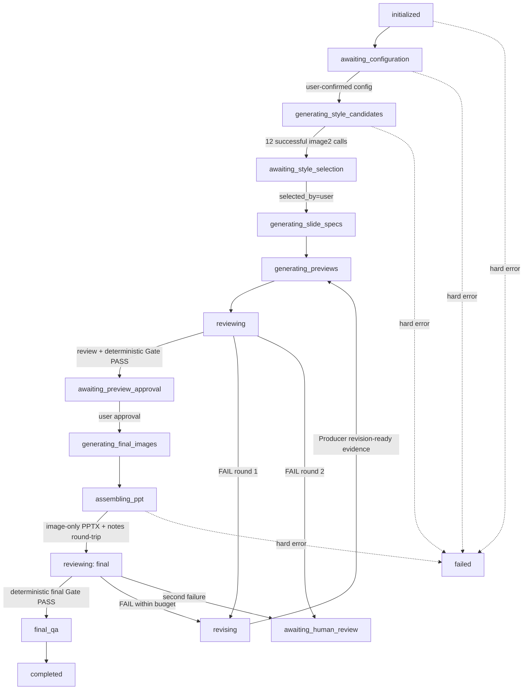

# Multi-Agent PPT 生产架构

## 1. 设计目标

将 PPT 生产从“一次性生成任务”改为可恢复、可审计、有人类授权边界的生产系统。生成模型负责规划和产出；确定性代码负责状态、数据、结构、计数、备注回读与最终 PASS/FAIL。

## 2. 权限分层

| 层 | 主体 | 可以做什么 | 不能做什么 |
|---|---|---|---|
| Control plane | Orchestrator | 解释需求、路由模型、授权阶段、写状态、持久化 Reviewer 返回 | 自行宣布审核通过、代替用户确认 |
| Production plane | Producer / Workers | 产出 outline、spec、prompt、notes、结构化修订 | 写状态、修改 evaluation、跨人工 Gate |
| Visual plane | image2 + deterministic renderers | image2 生成视觉；代码叠加准确文本/数字/图表 | image2 渲染不可核验数据；presentation 参与设计 |
| Review plane | Reviewer / Final Reviewer | 在冻结包内按 Rubric 评分和举证 | 读取 Producer 私有上下文、写文件、调用生成/修改工具 |
| Decision plane | deterministic code | Schema、计数、分辨率、数据、字体、PPTX、notes、加权 Gate | 接受模型自报的 `passed` 或 `total_score` |

## 3. 端到端控制流



`awaiting_configuration`、`awaiting_style_selection`、`awaiting_preview_approval` 是人工 Gate。一次 invocation 最多到达下一个人工 Gate，并立即返回。

## 4. 状态与证据

`output/build-state.yaml` 是唯一事实源，`build-status.json` 仅作兼容镜像。每次 transition 必须包含：

- `from` / `to`
- `stage`
- UTC timestamp
- `actor: orchestrator`
- 至少一个已经存在的 `evidence_files`
- message

`completed` 的证据必须包含真实 `gate-decision.json`，且其 `passed` 与 `deterministic_checks_passed` 都为 `true`。

## 5. Artifact 生命周期

```text
user input
  -> deck-config.pending.yaml
  -> deck-config.confirmed.yaml
  -> style-candidates/ + image-generation-manifest.json
  -> selected-style.yaml
  -> outline.md + slide-specs/ + metrics/chart-data
  -> preview-images/
  -> review-pack/round-XX/ (frozen)
  -> reviews/round-XX/evaluation.json
  -> reviews/round-XX/deterministic-checks.json
  -> reviews/round-XX/gate-decision.json
  -> final-images/ + final-images-qa.json
  -> presentation.pptx + notesSlides verification
```

失败审核产生 `artifacts/round-XX/structured-issues.json`。Producer 完成修订后写入 `revision-ready.json` 作为 Orchestrator 继续再生成的证据。旧 review-pack、evaluation 和 artifact round 不得覆盖。

## 6. Reviewer 隔离

Orchestrator 将允许的文件复制到 `review-pack/round-XX/`，记录 SHA-256 和字节数，并尽可能设为只读。Reviewer session 只解析该目录的相对路径。

不进入 review-pack 的信息包括：Producer 对话、思考过程、自评、模型信息、日志和说服性总结。Reviewer 只返回 JSON；宿主以 Orchestrator 身份追加保存，Reviewer 本身没有文件写权限。

## 7. 确定性 Gate

Reviewer 提供维度评分、critical failures 和有证据的 issues。`review_gate.py` 忽略其自报总分与通过标记，按 Rubric 权重重算：

```text
passed = no schema/evidence errors
         AND weighted_score >= 85
         AND critical_failure_count == 0
         AND deterministic_checks_passed == true
```

`deterministic_checks.py` 聚合 selected-style、image2 provenance、spec/图片数量、PNG 分辨率、字体、数据、final-image QA、PPTX 结构和 notesSlides 回读。任何缺失都按失败处理。

## 8. presentation 边界

组装 adapter 只接收以下 allowlist：

1. create blank 16:9 deck；
2. insert one final image full-slide；
3. write matching speaker note；
4. save；
5. reopen and verify notes。

如果出现正文文本框、图形、图表、非满版图片、被修改的 final-image 或 image2 失败后的替代页面，构建失败。
